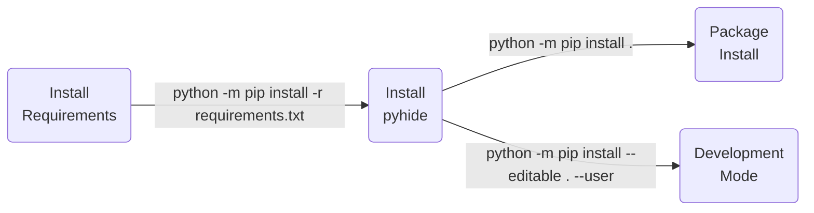

| **Authors**  | **Project** |  **Build Status** | **Code Quality** |
|:------------:|:-----------:|:-----------------:|:----------------:|
| [**N. Curti**](https://github.com/Nico-Curti) | **pyhide** | [](https://github.com/Nico-Curti/pyhide/actions/workflows/python.yml) | [](https://codecov.io/gh/Nico-Curti/pyhide) <br> [](https://codebeat.co/projects/github-com-nico-curti-pyhide-main) <br> [](https://app.codacy.com/gh/Nico-Curti/pyhide/dashboard?utm_source=gh&utm_medium=referral&utm_content=&utm_campaign=Badge_grade) |

[](https://github.com/Nico-Curti/pyhide/pulls)
[](https://github.com/Nico-Curti/pyhide/issues)

[](https://github.com/Nico-Curti/pyhide/stargazers)
[](https://github.com/Nico-Curti/pyhide/watchers)

# pyhide v0.0.1

## A simple python code obfuscator

* [Overview](#overview)
* [Installation](#installation)
* [Usage](#usage)
* [Testing](#testing)
* [Contribution](#contribution)
* [References](#references)
* [FAQ](#faq)
* [Authors](#authors)
* [License](#license)
* [Acknowledgments](#acknowledgments)
* [Citation](#citation)

## Overview

The code is freely inspired by the original package of [brandonasuncion](https://github.com/brandonasuncion) available [here](https://github.com/brandonasuncion/Python-Code-Obfuscator).

The purpose is to create an hard-to-read python code to "encrypt", or better "obfuscate", the original code.

## Installation

Python version supported : 

~~The easiest way to the get the `pyhide` package in `Python` is via pip installation~~

<strike>

```bash
python -m pip install pyhide
```

</strike>

~~or via `conda`:~~

<strike>

```bash
conda install pyhide
```

</strike>

The `Python` installation for *developers* is executed using [`setup.py`](https://github.com/Nico-Curti/pyhide/blob/main/setup.py) script.



## Usage

You can use the `pyhide` library via command line.

```bash
$ pyhide --help
usage: pyhide [-h] [--version] --input INPTFILE [--output OUTFILE] [--variable] [--function] [--class] [--pkg] [--num]

pyhide - Python code obfuscator

optional arguments:
  -h, --help            show this help message and exit
  --version, -v         Get the current version installed
  --input INPTFILE, -i INPTFILE
                        Input python file to obfuscate
  --output OUTFILE, -o OUTFILE
                        Output obfuscated python code
  --variable, -x        Enable/Disable the variable encoding
  --function, -f        Enable/Disable the function encoding
  --class, -c           Enable/Disable the class encoding
  --pkg, -p             Enable/Disable the package encoding
  --num, -n             Enable/Disable the number encoding
  --str, -s             Enable/Disable the string encoding

pyHide Python package v0.0.1
```

### Examples

The code obfuscator performs a full encoding of the original Python script, preserving the correctness of the syntax and providing a novel ready-to-use Python code.

A list of examples is showed below:

<details><summary><b>Hello World</b></summary>
<p>

<b>cmd</b>
```bash
pyhide --input hello_world.py --variable --function --class --pkg --num --str
```

<b>Original</b>

```python
#!/usr/bin/env python
# -*- coding: utf-8 -*-

print('Hello World', end='', flush=True)
```

<b>Obfuscated</b>

```python
______ = ((() == []) + (() == [])) ** ((() == []) + (() == []))
_____ = (() == []) + (() == [])
getattr(__import__('\x62\x75\x69\x6c\x74\x69\x6e\x73'), '\x70\x72\x69\x6e\x74')('\x48\x65\x6c\x6c\x6f\x20\x57\x6f\x72\x6c\x64', end='', flush=() == ())
```
</p>
</details>

<details><summary><b>Simple Function</b></summary>
<p>

<b>cmd</b>
```bash
pyhide --input simple_func.py --variable --function --class --pkg --num --str
```

<b>Original</b>

```python
def func (a, b, c):
  return a + b + c

print(func(1, 2, 3), end='', flush=True)
```

<b>Obfuscated</b>

```python
__________ = ((() == []) + (() == [])) ** ((() == []) + (() == [])) + (((() == []) + (() == [])) ** ((() == []) + (() == [])) << ((() == []) + (() == [])) ** ((() == []) + (() == [])))
_________ = ((() == []) + (() == [])) ** ((() == []) + (() == [])) << ((() == []) + (() == [])) ** ((() == []) + (() == []))
________ = ((() == []) + (() == [])) ** ((() == []) + (() == []))
_______ = (() == []) + (() == [])

def ______________(___________, ____________, _____________):
  return ___________ + ____________ + _____________

getattr(__import__('\x62\x75\x69\x6c\x74\x69\x6e\x73'), '\x70\x72\x69\x6e\x74')(______________(________, _________, __________), end='', flush=() == ())
```
</p>
</details>

<details><summary><b>Package Function</b></summary>
<p>

<b>cmd</b>
```bash
pyhide --input simple_pkg.py --variable --function --class --pkg --num --str
```

<b>Original</b>

```python
import numpy as np

def func (a, b, c):
  return np.sum([a, b, c])

print(func(1, 2, 3), end='', flush=True)
```

<b>Obfuscated</b>

```python
__________ = ((() == []) + (() == [])) ** ((() == []) + (() == [])) + (((() == []) + (() == [])) ** ((() == []) + (() == [])) << ((() == []) + (() == [])) ** ((() == []) + (() == [])))
_________ = ((() == []) + (() == [])) ** ((() == []) + (() == [])) << ((() == []) + (() == [])) ** ((() == []) + (() == []))
________ = ((() == []) + (() == [])) ** ((() == []) + (() == []))
_______ = (() == []) + (() == [])
import numpy as np

def ______________(___________, ____________, _____________):
  return getattr(__import__('\x62\x75\x69\x6c\x74\x69\x6e\x73'), '\x67\x65\x74\x61\x74\x74\x72')(getattr(__import__('\x62\x75\x69\x6c\x74\x69\x6e\x73'), '\x67\x65\x74\x61\x74\x74\x72')(__import__('\x62\x75\x69\x6c\x74\x69\x6e\x73'), '\x5f\x5f\x69\x6d\x70\x6f\x72\x74\x5f\x5f')('\x6e\x75\x6d\x70\x79'), '\x73\x75\x6d')([___________, ____________, _____________])
getattr(__import__('\x62\x75\x69\x6c\x74\x69\x6e\x73'), '\x70\x72\x69\x6e\x74')(______________(________, _________, __________), end='', flush=() == ())
```
</p>
</details>

<details><summary><b>Class Definition</b></summary>
<p>

<b>cmd</b>
```bash
pyhide --input simple_class.py --variable --function --class --pkg --num --str
```

<b>Original</b>

```python
class A:

  def __init__ (self, l):
    self.list = l

  def func (self, x):
    return self.list + x

a = A([1, 2, 3])
print(a.func([1, 2, 3]), end='', flush=True)
```

<b>Obfuscated</b>

```python
__________ = ((() == []) + (() == [])) ** ((() == []) + (() == [])) + (((() == []) + (() == [])) ** ((() == []) + (() == [])) << ((() == []) + (() == [])) ** ((() == []) + (() == [])))
_________ = ((() == []) + (() == [])) ** ((() == []) + (() == [])) << ((() == []) + (() == [])) ** ((() == []) + (() == []))
________ = ((() == []) + (() == [])) ** ((() == []) + (() == []))
_______ = (() == []) + (() == [])

class ________________:

  def __init__(self, ____________):
    self._____________ = ____________

  def _______________(self, ______________):
    return self._____________ + ______________
___________ = ________________([________, _________, __________])
getattr(__import__('\x62\x75\x69\x6c\x74\x69\x6e\x73'), '\x70\x72\x69\x6e\x74')(___________._______________([________, _________, __________]), end='', flush=() == ())
```
</p>
</details>

## Testing

A full set of testing functions is provided in the [test](https://github.com/Nico-Curti/pyhide/blob/main/test) directory.
The tests aim to cover the full set of APIs proposed in the `pyhide` package.
If you want to contribute in the development of the library, please ensure that your new features will not affect the test results.

The tests are performed using the [`pytest`](https://github.com/pytest-dev/pytest/) Python package.
You can run the full list of tests with:

```bash
python -m pip install -r ./test/requirements.txt
python -m pytest ./test/ --cov=pyhide --cov-config=.coveragerc
```

in the project root directory.

The continuous integration using `github-actions` and `Appveyor` tests each function in every commit, thus pay attention to the status badges before use this package or use the latest stable version available.

## Contribution

Any contribution is more than welcome :heart:. Just fill an [issue](https://github.com/Nico-Curti/pyhide/blob/main/.github/ISSUE_TEMPLATE/ISSUE_TEMPLATE.md) or a [pull request](https://github.com/Nico-Curti/pyhide/blob/main/.github/PULL_REQUEST_TEMPLATE/PULL_REQUEST_TEMPLATE.md) and we will check ASAP!

See [here](https://github.com/Nico-Curti/pyhide/blob/main/.github/CONTRIBUTING.md) for further information about how to contribute with this project.

## References

<blockquote>1- https://github.com/brandonasuncion/Python-Code-Obfuscator</blockquote>

## FAQ

**Is it the obfuscator invertible?**

> Yes, it is... but it requires an hard work at least.

**Does the obfuscated code requires some packages or external program to run?**

> No, it is a pure python code... just a complicated one.

**Can I use the package to re-obfuscate an obfuscated code?**

> Yes you can... but you must pay attention to the string encoding: the encoding is simply made by the hex function so when the file is re-loaded the strings are restored.

## Limits and current issues

* The obfuscated code is still quite readable... I need to better encode some parts
* The obfuscated code could be increase in terms of lines' length...
* If a pkg function use keywords with the same name of other variables they will be incorrectly replaced

## Authors

*  [](https://github.com/Nico-Curti) [](https://www.unibo.it/sitoweb/nico.curti2) **Nico Curti**

See also the list of [contributors](https://github.com/Nico-Curti/pyhide/contributors) [](https://github.com/Nico-Curti/pyhide/graphs/contributors/) who participated in this project.

## License

The `pyhide` package is licensed under the MIT [License](https://github.com/Nico-Curti/pyhide/blob/main/LICENSE).

## Acknowledgments

Thanks goes to all contributors of this project.

## Citation

If you have found `pyhide` helpful in your research, please consider citing the original repository

```BibTeX
@misc{pyhide,
  author = {Curti, Nico},
  title = {pyhide - A simple python code obfuscator},
  year = {2023},
  publisher = {GitHub},
  howpublished = {\url{https://github.com/Nico-Curti/pyhide}}
}
```

